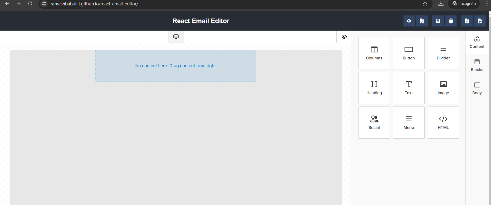

# React Email Editor

This is a simple email template editor forked from Unlayered.

## Operational Buttons
0. Show Preview
1. Download HTML
2. Save Design Draft
3. Delete Design Draft
4. Export Design
5. Import Design




## Commands
Run following commands
- Parent directory: `npm install`
- Demo directory: `npm install`
- Build: `npm run build`
- Run locally: `npm run start`
- Deploy to GitHub Pages: `npm run deploy`


## GitHub Page Publishing Issues (only for developerreference)

There were issues while publishing the demo to GitHub Pages due to the way parcel works. All the issues have been fixed.

References:
- [So you want to host your single-page React app on GitHub Pages](https://itnext.io/so-you-want-to-host-your-single-age-react-app-on-github-pages-a826ab01e48)
- [Building a static single-page application with JavaScript for GitHub Pages and more](https://medium.com/swlh/building-a-static-single-page-application-with-javascript-for-github-pages-and-more-eb568b436bea#8f76)
- [Solved: React app bundled with Parcel would not deploy correctly in GitHub Pages](https://dev.to/gabrieldiem/solved-react-app-bundled-with-parcel-would-not-deploy-correctly-in-github-pages-1pde)

The key issue was related to the usage of React components `BrowserRouter`, `Route`, and `Link`. The breaking point was identified and resolved.

### Steps to Fix

1. Created `demo/.env` file:
    ```
    BASE_RELATIVE_PATH="/react-email-editor"
    NODE_ENV=production
    ```

2. Created `/src/dashboard/BasePath.tsx` to export the `BASE_RELATIVE_PATH` based on the environment.

3. Prefixed all occurrences of `Link to` and route paths:
    ```jsx
    <Link to={`${baseRelativePath}/dashboard`}>Dashboard</Link>
    import baseRelativePath from './BasePath';
    ```

4. Updated `package.json` for GitHub Pages:
    ```json
    "homepage": "http://rameshbabuiiit.github.io/react-email-editor",
    "build": "parcel build index.html --public-url /react-email-editor/",
    "predeploy": "npm run build",
    "deploy": "gh-pages -d dist"
    ```
    Added `gh-pages` as a dev dependency.

5. For running locally do following changes
package.json
  ```json
    "build": "parcel build index.html",
    ```
.env
```json
    NODE_ENV=development
    ```

